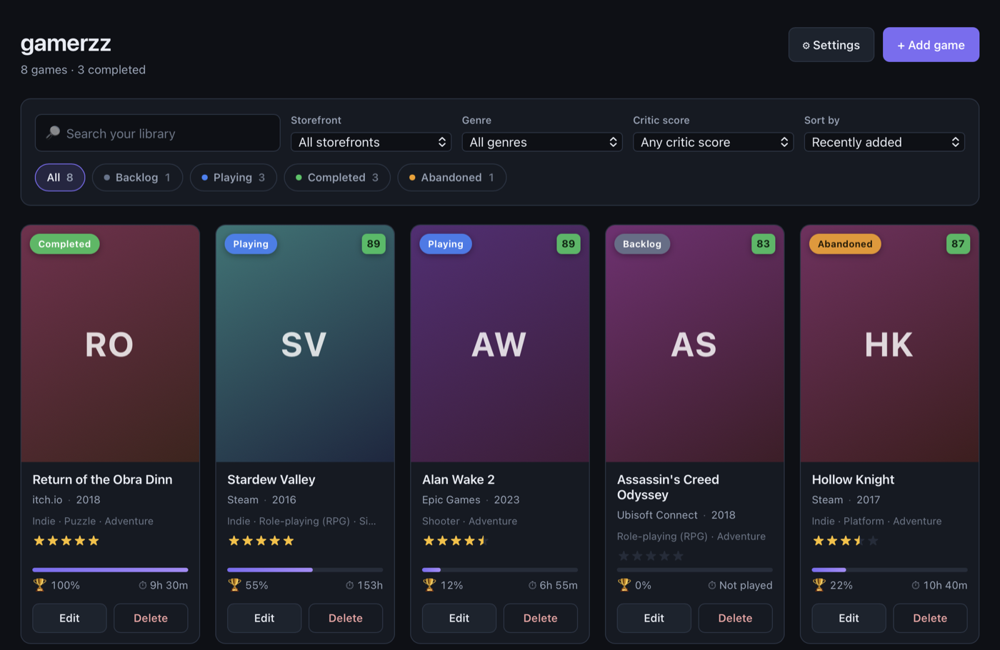

# gamerzz

A local game library for your PC collection. Track what you own across Steam, Epic, GOG and
anywhere else — what you're playing, what you finished, how long you played, and what you
thought of it.

Everything is stored on your own computer. There is no account, no sync and no server.



<p align="center"><em>The library view, with the sample collection loaded.</em></p>

---

## Table of contents

- [For the person using the app](#for-the-person-using-the-app)
  - [Installing on Windows](#installing-on-windows)
  - ["Windows protected your PC"](#windows-protected-your-pc)
  - [Adding your first game](#adding-your-first-game)
  - [Turning on game search (IGDB)](#turning-on-game-search-igdb)
  - [Where your data lives](#where-your-data-lives)
  - [Uninstalling](#uninstalling)
- [For the developer](#for-the-developer)
  - [Running it locally](#running-it-locally)
  - [Building the Windows installer](#building-the-windows-installer) — step by step from a
    blank machine
    - [Step 1 — Install Node.js](#step-1--install-nodejs)
    - [Step 2 — Install Rust](#step-2--install-rust)
    - [Step 3 — Install the Microsoft C++ build tools](#step-3--install-the-microsoft-c-build-tools)
    - [Step 4 — Check WebView2](#step-4--check-webview2-almost-certainly-already-fine)
    - [Step 5 — Confirm the toolchain](#step-5--confirm-the-toolchain)
    - [Step 6 — Get the source and install dependencies](#step-6--get-the-source-and-install-dependencies)
    - [Step 7 — Build](#step-7--build)
    - [Step 8 — Collect the installer](#step-8--collect-the-installer)
    - [If the build fails](#if-the-build-fails)
    - [Cleaning up a development machine](#cleaning-up-a-development-machine)
  - [Project layout](#project-layout)
  - [How it works](#how-it-works)

---

## For the person using the app

### Installing on Windows

1. Double-click **`gamerzz_1.0.0_x64-setup.exe`**.
2. Read the [warning section below](#windows-protected-your-pc) — you will see a blue screen,
   and it is expected.
3. Follow the installer. It installs just for you, so it will **not** ask for an administrator
   password.
4. Open **gamerzz** from the Start menu.

### "Windows protected your PC"

**You will see this, and it does not mean anything is wrong.**

When you run the installer, Windows will show a blue window saying:

> **Windows protected your PC**
> Microsoft Defender SmartScreen prevented an unrecognised app from starting.

This happens to every app that has not been signed with a paid certificate. It is a statement
about paperwork, not about the app.

To continue:

1. Click **More info** (small text, under the message).
2. Click the **Run anyway** button that appears.

You only have to do this once, when installing. Opening the app afterwards is normal.

### Adding your first game

Click **+ Add game**. The only thing you *must* fill in is the title — everything else has a
sensible default you can come back to later.

| Field | What it means |
| --- | --- |
| **Title** | The name of the game. Required. |
| **Storefront** | Where you bought or downloaded it: Steam, Epic, GOG, and so on. Missing yours? Pick **+ Add storefront…** and type it in. |
| **Status** | Which of seven shelves the game sits on — see [Statuses](#statuses) below. |
| **Achievements completed** | A percentage from 0 to 100. Typed in by hand. Tick **This game has no achievements** if there are none to earn — plenty of Epic, GOG and itch.io titles have none, and Undertale has none on Steam either. That's a different thing from 0%, and the app keeps them apart. |
| **Play time** | Hours and minutes. Typed in by hand. |
| **Your rating** | 0 to 5 stars, in **halves**. Click the left half of a star for a half, the right half for a whole. Click the same spot again to clear it. You can also focus the stars and use the arrow keys. |
| **Critic score** | What reviewers thought, out of 100. Filled in automatically from IGDB when you use search; otherwise leave it blank or type it in. Shown as a coloured chip in the corner of the cover. |
| **Genres** | Filled in automatically from IGDB, or pick your own from the list. A game can have as many as you like — click a genre to remove it. |
| **Cover image** | **Choose file…** to pick a picture from your computer, or **Paste link** for an image address from the web. If you leave it blank, the app draws a coloured tile with the game's initials. |
| **Notes** | Anything you want to remember. Optional. |

### Statuses

Every game sits on exactly one of seven shelves.

| Status | | What it means |
| --- | --- | --- |
| **Playing** | ⬤ green | On your desk right now. Says nothing about how far through you are. |
| **Abandoned** | ⬤ red | Played, and you're not going back. The reason doesn't matter. |
| **Backlog** | ⬤ grey | Bought and never touched. No playtime. |
| **Attempted** | ⬤ blue | Played, the credits haven't rolled, and you mean to come back to it. |
| **Completed** | ⬤ gold | The main credits have rolled — the story, plus whatever side content you picked up on the way. Where most people stop. |
| **Platinum** | ⬤ white | You're done by a measure the game itself keeps: its achievements, or its own completion metric. |
| **Above and Beyond** | ⬤ fuchsia | You're done past what the game measures — the optional boss no ending requires, the collection nothing tracks. Actual 100%. |

**Above and Beyond** is for the games where the credits and the achievement list both stop short
of what you'd call finished. No ending in Dark Souls III needs the Nameless King, no achievement
in Silksong needs Shakra, and Elden Ring rolls credits with Malenia alive — but plenty of people
beat them anyway before calling the game done. Same for every weapon and armour set in The
Witcher 3, or the optional challenges behind Control's outfits. None of it is counted anywhere,
which is exactly why it gets a shelf.

These are seven independent shelves, not a ranking. **Platinum doesn't count as Completed, and
Above and Beyond doesn't count as Platinum** — the header line counts all three separately, on
purpose. They're listed in the order the buttons appear: what you're doing right now first, then
how far each game got.

Two of them restate numbers the app already has, so when a status disagrees with the figures
you've typed, a line of grey text appears under the dropdown: *"You've played this — Attempted?"*
for a Backlog game with time on it, and *"100% achievements — Platinum?"* for an Attempted or
Completed game at 100%. It's a suggestion and nothing more — it never blocks a save, and never
changes the field for you. Platinum, Above and Beyond, Abandoned and Playing are always left
alone: a Platinum at 94% is your call, plenty of games have no achievements at all, and a game
you're playing might have no hours yet or every achievement already. Nothing ever suggests Above
and Beyond either — no percentage could know whether you beat the optional boss.

Once you have a few games, use the search box, the coloured status buttons and the
storefront, genre, critic-score and sort dropdowns to find things. The genre dropdown only
lists genres you actually have, so it can never come back empty-handed.

**Sorting runs both ways.** Pick what to sort by — date added, title, your rating, critic score,
playtime or completion — and use the button beside the dropdown to flip the order. It tells you
which way you're looking at: **Most played** flips to **Least played**, **A–Z** to **Z–A**,
**Newest first** to **Oldest first**. The flip sticks when you change what you're sorting by, so
if you've reversed the order it stays reversed until you press it again.

Games with nothing to sort on stay at the bottom either way. Sorting by critic score puts the
games nobody has reviewed last whichever direction you choose, and sorting by your rating does
the same for games you haven't rated — "no score" isn't a bad score, so **Lowest rated** shows
you the games you actually disliked rather than every game you never got round to rating.
Sorting by completion treats games with no achievements the same way: **Least complete** shows
you what you've barely started, not the games that have nothing to complete.

> **Just want to look around first?** Open **⚙ Settings → Load sample library** to fill the app
> with nine example games, and remove them again with one click when you're done.

### Turning on game search (IGDB)

**This is optional.** The app works perfectly without it — this only saves you typing.

IGDB is a games database. Connecting it lets you search for a game when adding it, and fills in
the cover art, description, release date, genres and critic score automatically.

One thing it cannot fill in is the **storefront** — IGDB describes platforms as hardware
("PC", "PlayStation 5"), not as shops, so Steam vs GOG is always your choice. Critic scores
are also missing for a lot of games, indie and very recent releases especially; that is IGDB
having no data rather than anything going wrong.

IGDB is owned by Twitch, so you sign up through a Twitch account:

1. Go to **[dev.twitch.tv/console/apps](https://dev.twitch.tv/console/apps)** and sign in.
   (Create a free Twitch account if you don't have one.)
2. Click **Register Your Application**.
3. Fill it in:
   - **Name** — anything, for example `my gamerzz`
   - **OAuth Redirect URLs** — `http://localhost`
   - **Category** — anything, for example *Application Integration*
   - **Client Type** — *Confidential*
4. Click **Create**.
5. Back on the list, click **Manage** next to your new application.
6. Copy the **Client ID**.
7. Click **New Secret**, confirm, and copy the **Client Secret**. *Copy it now — Twitch will not
   show it to you again.*
8. In gamerzz, open **⚙ Settings**, paste both values, and click **Connect**.

You'll get a green confirmation if it worked, or a plain-English explanation if it didn't.
Nothing is saved unless the connection actually succeeds.

After that, the **Add game** window gains a *Search IGDB* button.

### Where your data lives

Everything — the database and every cover image — sits in one folder:

| | |
| --- | --- |
| **Windows** | `C:\Users\<you>\AppData\Roaming\com.gamerzz.library` |
| **macOS** | `~/Library/Application Support/com.gamerzz.library` |

**⚙ Settings → Open data folder** takes you straight there.

Inside you'll find `gamerzz.db` (all your games) and a `covers` folder (all the images).
Copying that folder somewhere safe is a complete backup; there is no built-in backup feature.

### Uninstalling

**Your library is kept unless you explicitly ask for it to be deleted.** The uninstaller has a
tick box for that, and it starts **unticked** — so an ordinary uninstall leaves your games
behind, and reinstalling later picks them straight back up.

1. Open **Settings → Apps → Installed apps** (on Windows 10: *Apps & features*).
2. Find **gamerzz** in the list.
3. Click the **⋯** menu next to it and choose **Uninstall**.
4. The uninstaller opens and asks you to confirm. Look for the
   **Delete application data** tick box:
   - **Leave it unticked** to keep your library. This is the default.
   - **Tick it** to erase everything — the database and every cover image.
5. Click **Uninstall**.

No administrator password is needed, because the app installs for your user account only.

> **Want a copy of your library before you uninstall?** Open **⚙ Settings → Open data folder**
> *first* and copy that folder somewhere safe. Once the uninstaller has deleted it, it is gone —
> there is no recycle bin step and no undo.

#### What gets removed

| | Ordinary uninstall | With **Delete application data** ticked |
| --- | --- | --- |
| The program itself (`%LOCALAPPDATA%\gamerzz`) | Removed | Removed |
| Start menu and desktop shortcuts | Removed | Removed |
| Your games, ratings and cover images | **Kept** | Removed |
| Your saved IGDB credentials | **Kept** | Removed |

The data the second column removes is exactly the folder named in
[Where your data lives](#where-your-data-lives) — you can also just delete that folder by hand
at any time, with or without uninstalling. Deleting it while the app is closed resets gamerzz to
a completely fresh state.

#### Two things not to do

- **Don't uninstall WebView2.** Windows and other applications share it. Removing gamerzz does
  not touch it, and it shouldn't.
- **Don't just delete the program folder.** That leaves gamerzz listed in *Installed apps* with
  no working uninstaller. Use the steps above instead.

#### Uninstalling on macOS

Drag **gamerzz.app** to the Trash, then delete
`~/Library/Application Support/com.gamerzz.library` if you also want the library gone. macOS has
no uninstaller, so the data folder is never removed for you.

---

## For the developer

### Running it locally

Prerequisites: [Node.js](https://nodejs.org) **20.19+ or 22.12+** (Vite 7 refuses to start on
anything older) and [Rust](https://rustup.rs) **1.77.2+**. On Windows, follow the
[step-by-step guide below](#building-the-windows-installer) instead — there is a third
prerequisite there.

```bash
npm install
```

```bash
npm start
```

`npm start` runs `tauri dev`: Vite serves the frontend with hot reload, and the Rust side
rebuilds on change. The first run compiles the whole Rust dependency tree and takes a few
minutes; after that it's seconds.

Useful checks:

```bash
npx tsc --noEmit && cargo check --manifest-path src-tauri/Cargo.toml
```

```bash
cargo test --manifest-path src-tauri/Cargo.toml --lib
```

The Rust tests cover the fiddly pure logic: converting IGDB's Unix release timestamps to
ISO dates (including leap years and pre-1970 dates), escaping search terms before they go
into an IGDB query string, rounding IGDB's fractional critic scores, and normalising image
file extensions.

### Building the Windows installer

**Build this on a Windows machine.** Cross-compiling from macOS is possible for some targets but
not worth the trouble; a Windows box is the supported path.

This walks through a machine with nothing installed. Budget about **30–45 minutes**, most of it
downloads — the Visual Studio installer alone is a few GB, and the first Rust compile takes
several minutes. Everything after the first build takes seconds.

You need three things: **Node.js**, **Rust**, and **Microsoft's C++ build tools**. The third one
catches people out — Rust on Windows uses Microsoft's linker rather than shipping its own, so
without it the build fails at the very last step.

#### Step 1 — Install Node.js

1. Go to **[nodejs.org/en/download](https://nodejs.org/en/download)**.
2. Download the **LTS** Windows Installer (`.msi`), 64-bit.
3. Run it and accept the defaults. You do **not** need the "Tools for Native Modules" checkbox
   (Step 3 covers that ground properly).

> **Version matters here.** Vite 7 requires Node **20.19+ or 22.12+** and refuses to start on
> anything older. If you already have Node, check with `node --version` before assuming it's
> fine. To manage several versions, use [nvm-windows](https://github.com/coreybutler/nvm-windows).

Guide, if you want more detail: [Node.js — Windows install](https://nodejs.org/en/download).

#### Step 2 — Install Rust

1. Go to **[rustup.rs](https://rustup.rs)** and download **`rustup-init.exe`** (64-bit).
2. Run it. It opens a console window.
3. It will notice whether the C++ build tools from Step 3 are present. If it offers to install
   them for you, **say yes** — that satisfies Step 3 and you can skip it.
4. Otherwise choose **1) Proceed with standard installation**.
5. **Close and reopen your terminal** when it finishes, so `PATH` picks up Cargo.

This project needs Rust **1.77.2 or newer** (Tauri 2's minimum). A fresh rustup install is well
past that. On an existing install, run `rustup update`.

Guide: [The Rust Book — Installation](https://doc.rust-lang.org/book/ch01-01-installation.html).

#### Step 3 — Install the Microsoft C++ build tools

Skip this if rustup already did it in Step 2.

1. Go to **[visualstudio.microsoft.com/visual-cpp-build-tools](https://visualstudio.microsoft.com/visual-cpp-build-tools/)**
   and click **Download Build Tools**. (This is the standalone build tools package — you do not
   need full Visual Studio, though it works too if you already have it.)
2. Run the downloaded installer.
3. On the **Workloads** tab, tick **Desktop development with C++**.
4. Click **Install**. This is the big download.
5. **Reboot** if it asks.

Guide: [Microsoft — Install C++ support in Visual Studio](https://learn.microsoft.com/en-us/cpp/build/vscpp-step-0-installation).

#### Step 4 — Check WebView2 (almost certainly already fine)

The app renders through **WebView2**, which ships with Windows 11 and current Windows 10, so
there is usually nothing to do. If you're on an old or stripped-down Windows install, get the
**Evergreen Bootstrapper** from
[Microsoft's WebView2 page](https://developer.microsoft.com/en-us/microsoft-edge/webview2/).

Either way the finished installer adds WebView2 automatically on machines that lack it, so your
end user never has to think about this.

#### Step 5 — Confirm the toolchain

Open a **new** PowerShell or Command Prompt window and run these. All four must print a version:

```powershell
node --version; npm --version; rustc --version; cargo --version
```

Node must be **20.19+ or 22.12+**, and `rustc` must be **1.77.2+** — anything rustup installs
today is comfortably past that. If a command says it is not recognised, either that tool did not
install, or the terminal was opened before it was — reopen the terminal first, and only
reinstall if it is still missing.

#### Step 6 — Get the source and install dependencies

Get the project onto the machine — clone it with git, or copy/unzip the folder. Keep the path
short and free of accents (`C:\dev\gamerzz` is a good choice); deeply nested paths can trip
Windows' path length limit during the Rust build.

Then open a terminal **in that folder**. The quickest way: open the folder in File Explorer,
hold **Shift**, right-click empty space, and choose **Open PowerShell window here**. Or from any
terminal:

```powershell
cd C:\dev\gamerzz
```

You're in the right place if `dir` shows `package.json` and a `src-tauri` folder. Now:

```powershell
npm install
```

This only fetches the JavaScript side. Rust dependencies are fetched by the build itself.

#### Step 7 — Build

```powershell
npm run package
```

The first run compiles the entire Rust dependency tree — expect **5–15 minutes** and a lot of
scrolling. Later builds are far quicker.

To check things work before committing to a full build, run the app in development mode instead:

```powershell
npm start
```

#### Step 8 — Collect the installer

```
src-tauri\target\release\bundle\nsis\gamerzz_1.0.0_x64-setup.exe
```

That single file is what you send to the person using the app. It is a **per-user** install
(`installMode: currentUser`), which is why it doesn't trigger a UAC administrator prompt. It is
**not code signed**, so SmartScreen warns on first run — the
[user section above](#windows-protected-your-pc) explains that to them. Signing would cost
roughly $200–400 a year for a certificate on a hardware token, or about $10 a month through
Azure Trusted Signing.

#### If the build fails

| What you see | What it means |
| --- | --- |
| `linker 'link.exe' not found` | Step 3 is missing or incomplete. Install **Desktop development with C++**, then reopen the terminal. This is far and away the most common failure. |
| `'npm' is not recognized` / `'cargo' is not recognized` | The terminal was open before you installed it. Close it and open a new one. |
| Vite exits complaining about the Node version | Node is older than 20.19. Check `node --version` and upgrade. |
| `error: failed to run custom build command for 'tauri-build'` | Usually the same missing C++ tools as the first row. Read a few lines further up for the underlying error. |
| The build is extremely slow, or files vanish mid-build | Real-time antivirus scanning `target\`. Excluding the project folder from Windows Defender speeds Rust builds up considerably. |
| Something stays broken after a fix | Delete `src-tauri\target\` and `node_modules\`, then redo Steps 6–7. |

#### Building on macOS instead

`npm run package` produces a `.app` and a `.dmg`. Useful for testing the app itself; it cannot
produce the Windows `.exe`.

#### Cleaning up a development machine

Running `npm start` installs nothing, but it does leave two things behind.

**Build artifacts** — several GB once Rust has compiled everything. Safe to delete at any time;
the next build just takes longer:

```powershell
Remove-Item -Recurse -Force src-tauri\target, node_modules
```

```bash
rm -rf src-tauri/target node_modules
```

**A real data folder.** Development builds use the same identifier as the installed app, so
`npm start` reads and writes the *same* database as a released copy on that machine. Two
consequences worth knowing:

- Testing on your own machine will happily edit your real library. Back it up first.
- Deleting the repo does **not** delete that folder — remove it separately, using the paths in
  [Where your data lives](#where-your-data-lives).

To uninstall a build you installed from your own `.exe`, follow the
[uninstall steps above](#uninstalling); nothing about a locally built installer differs.

### Project layout

```
gamerzz/
├── src/                        React frontend (TypeScript)
│   ├── App.tsx                 State, filtering, sorting, dialog orchestration
│   ├── types.ts                Shared vocabulary; mirrors the games table
│   ├── styles.css              All styling. Plain CSS, custom properties, no framework
│   ├── lib/
│   │   ├── api.ts              The only place the frontend calls into Rust
│   │   ├── db.ts               Every SQL statement in the app
│   │   ├── format.ts           Playtime, dates, placeholder colours
│   │   └── sampleData.ts       The nine demo games
│   └── components/             One component per file
└── src-tauri/                  Rust backend
    ├── src/lib.rs              App builder + database schema and migrations
    ├── src/covers.rs           Cover download, copy and delete
    ├── src/igdb.rs             Twitch auth, token cache, IGDB search
    └── tauri.conf.json         Window, bundle and installer configuration
```

### How it works

**Storefront, not platform.** The `platform` column holds a PC storefront (Steam, GOG, Epic),
never console hardware — the app is PC-only. It's labelled *Storefront* throughout the UI. Note
that IGDB **cannot** fill this in: IGDB's platform data describes hardware, so the storefront is
always chosen by hand.

**One source of truth for progress.** There is no `completed` boolean. "Completed" is
`status = 'completed'`, derived wherever it's needed. Two fields describing one fact drift apart;
one field can't.

**Above and Beyond is a seventh status, not a flag on top of Platinum.** A boolean beside
`status` would say "past Platinum" more literally, but it would also let the database hold
`status = 'backlog'` alongside `above_and_beyond = 1` — the same drift the `completed` boolean
above was refused for. Migration 6 widens the CHECK instead, rebuilding the table because SQLite
cannot alter one in place. Nothing is backfilled, and nothing could be: the fact that puts a game
on this shelf — that you beat a boss the game never asked you to — is not in the database. See
`docs/adr/0007`.

**Half stars are a REAL column, not a doubled integer.** Storing "sevenths of a star" as `7`
would have avoided a migration, but every read and write would need to remember to halve or
double, and one place forgetting is a silent corruption. `rating` is `REAL` with a CHECK that
rejects anything finer than a half (`rating * 2 = CAST(rating * 2 AS INTEGER)`), so the
database itself refuses a 3.7. SQLite cannot change a column's type in place, so migration 2
rebuilds the table and copies the rows across.

**Genres are a JSON array in one column, not a join table.** They are only ever read as a
whole list and filtered in memory, so normalising them would buy joins and nothing else. A
malformed value degrades to "no genres" rather than taking the library down.

**The two rating scales are kept apart.** `rating` is what *you* thought, 0–5. `critic_rating`
is what reviewers thought, 0–100, and comes from IGDB's `aggregated_rating` — deliberately not
its `rating` field, which is an IGDB *user* score and would quietly mean something else. It is
nullable because most games genuinely have no critic aggregate, and a game with no score is left
out of the ordering entirely rather than treated as a low one. The sort dropdown says "Your
rating" and "Critic score" for the same reason: two different numbers should not share a word
where they sit side by side.

**Sorting is a key plus a direction, and the direction is relative.** `sort` names what to order
by; `direction` is `natural` or `reversed` rather than ascending or descending, because title's
conventional order (A–Z) runs opposite to every other key's (highest, most, newest first). A
literal ascending flag would hand you Z–A the first time you picked Title. Games with no value
for the active key are partitioned out and appended, so they sit at the bottom in both
directions. See `docs/adr/0003`.

**"No achievements" is `NULL`, not `0`.** `achievement_pct` is nullable, and null means the game
has no achievement system to make progress through — not that you have made none. A boolean
beside the percentage would have been the cheaper migration, but it lets the database hold "has
no achievements" and "87%" at the same time; one nullable column makes that unrepresentable.
Existing rows were not backfilled, because no heuristic can tell an untouched game from an
achievement-less one without silently rewriting somebody's library. See `docs/adr/0004`.

**Covers are copied in, never referenced.** Choosing a file copies it into the app's `covers`
folder; picking an IGDB result downloads the artwork there. The database stores only a filename.
A library therefore renders offline and survives the user reorganising their own files. Cancelling
the form deletes any image that was written during that session, and saving deletes the one it
replaced, so the folder doesn't accumulate orphans.

**Credentials never reach the webview.** IGDB's Client ID and Secret are written to
`igdb-credentials.json` in the app data folder and read only by Rust. The frontend can ask
*whether* credentials exist and can replace them, but cannot read them back — so they can't leak
through devtools or a page-source peek. The honest limit: anyone with access to the computer can
open that file. That's why each user registers their own Twitch application rather than sharing
one.

**Filtering and sorting happen in memory.** `listGames()` selects the whole table and the UI
filters it. A personal collection is hundreds of rows, so this is instant, and it keeps SQL out of
the code that changes most often.

**Deliberately not included:** auto-update, cloud sync, accounts, backup/restore, storefront
links, and any automatic playtime or achievement sync. Playtime and achievement percentages are
typed in by hand — Steam knows those numbers, but reading them needs the Steam Web API, a second
set of credentials and a SteamID, which is a different project.
